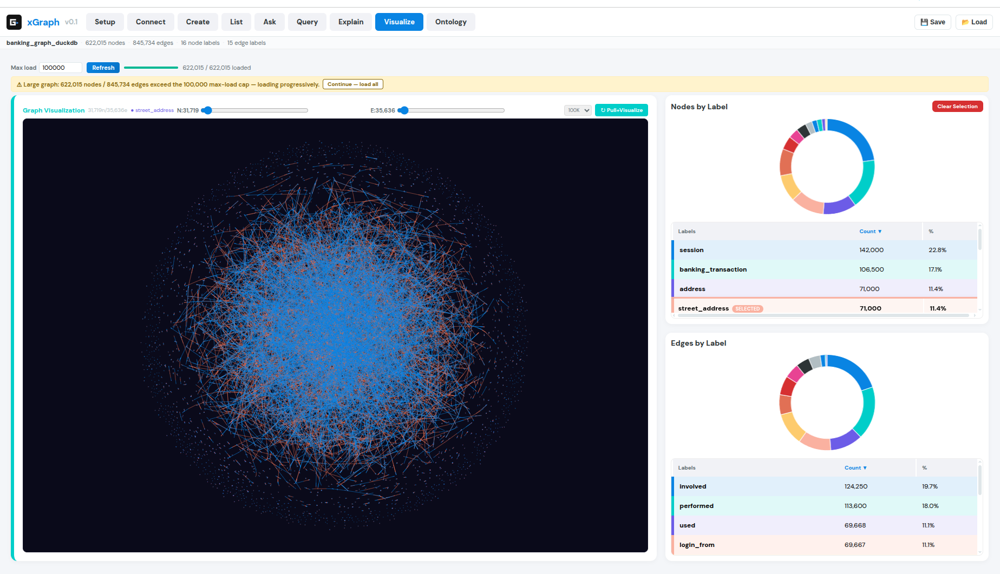
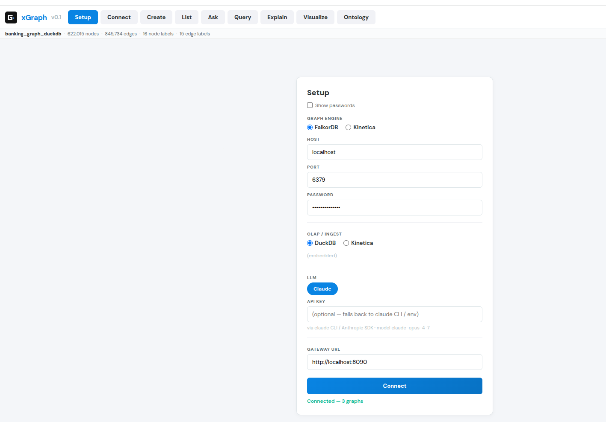
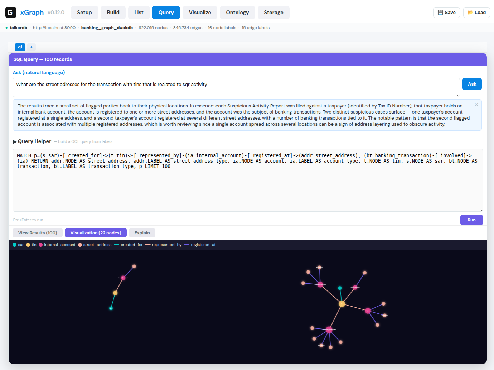
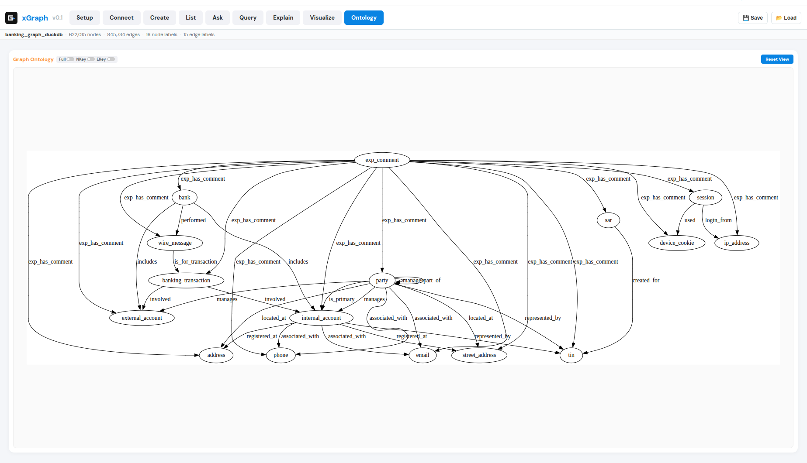
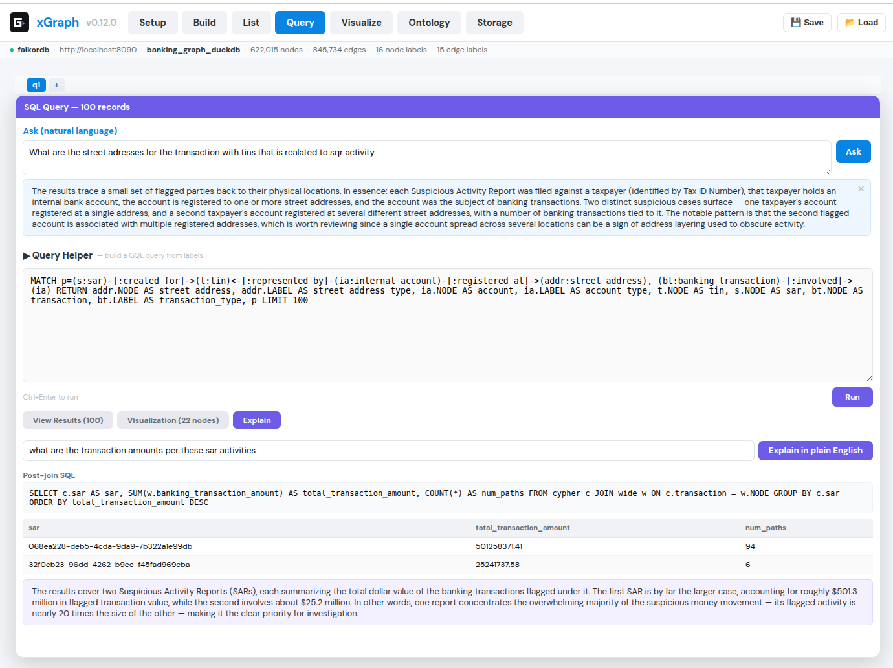

# xGraph

A **vendor-neutral graph workbench**: one browser UI and one HTTP API over multiple graph
engines. It replaces the per-vendor CLIs and one-off scripts you'd otherwise run to build,
query, explain, and visualize a graph — the whole pipeline becomes interactive.

xGraph began by unifying three sibling projects and is now **self-contained** — it depends on none
of them at runtime:

- **`falkor`** — its `graph_loader` package (multi-source read, multi-engine load, DuckDB
  late-hydration) is **vendored** into `backend/graph_loader/`.
- **`graphrag` / kgr** — only the small `_llm` backend was needed; it is **extracted** into
  `backend/xgraph_gateway/llm.py` (Claude via the `claude` CLI or the Anthropic SDK).
- **`explorer`** — a client-side React visualization app, **carried over** and neutralized into
  `frontend/` (force-graph, donut label charts, path rendering).



## Why it exists

Each engine ships its own console, query dialect, and loading tooling. Mirroring one graph
across engines — or just answering a question about it — meant switching tools and hand-editing
scripts. xGraph puts a single uniform API in front of them so the same workflow runs against any
configured engine, and a person drives it from one screen instead of a terminal.

## The three engine axes

You pick each independently in **Setup**:

| Axis | Choices | Role |
|---|---|---|
| **Graph engine** | Kinetica · FalkorDB | Stores the graph, runs the traversal (GQL or openCypher). |
| **OLAP / ingest** | Kinetica · DuckDB | Post-join, aggregation, and reading Parquet/CSV/S3. |
| **LLM** | Claude | NL→query, NL→SQL, and plain-English explanation. |

So `FalkorDB graph + DuckDB OLAP + Claude` is a fully on-prem, no-Kinetica route; `Kinetica graph
+ Kinetica OLAP` is the validation baseline. The gateway resolves the chosen combination behind
one API, so the frontend and every query stay engine-agnostic.



## The workflow

The action bar runs left to right:

**Setup · Connect · Create · Extract · List · Load · Ask · Query · Explain · Visualize · Ontology**

- **Create** — `CREATE OR REPLACE GRAPH`: build a FalkorDB graph from Parquet/CSV via falkor's
  loader, or run a Kinetica graph DDL. The target-graph name defaults to the active graph.
- **Extract** — build a graph **from documents**: upload a PDF/text file (or paste text) and the LLM
  extracts entities + relationships (open-ended ontology) that MERGE into a named graph on either
  engine. Re-running is idempotent, and the pushed sources are remembered per graph (see below).
- **List** — the graphs on the connected engine with node/edge counts; click to make one active, or
  **delete** it (🗑).
- **Ask** — natural-language question → generated query → run → English answer, kept as a per-graph
  **conversation history**.
- **Query** — write GQL/Cypher directly, in stacked tabs (`q1`, `q2`, …).
- **Explain** — turn a query's results into a plain-English, domain-relevant summary, with an
  optional focus that triggers a **post-join** (below).
- **Visualize** — progressive-paged graph render, colored by node `LABEL`, with label-selection
  and donut breakdowns.
- **Ontology** — the live label/relationship schema, refreshed automatically when the graph changes
  or a session loads.

A query and its path visualization, colored by node `LABEL`, with the **Hydrate attributes** button
that pulls wide columns (here `party_name`, `party_risk_score`) onto the returned ids:



The Ontology view — the server-side schema of `banking_graph_duckdb` (16 node labels, 15 edge labels):



## Featured use case: Explain with post-join hydration

This is the workbench's sharpest capability, and it depends on the **skinny-graph + late-hydration**
design (see below).

Run a suspicious-activity traversal in a Query tab:

```cypher
MATCH p=(a:sar)-[ab:created_for]->(b:tin)<-[bc:represented_by]-(c:party)-[cd:located_at]->(d:street_address)
RETURN a.NODE as a_node, b.NODE as b_node, ab.LABEL as ab_label,
       c.NODE as c_node, bc.LABEL as bc_label, d.NODE as d_node, cd.LABEL as cd_label, p
```

The graph is **skinny** — it returns party *ids* in `c_node`, but a party's `party_name` is not a
graph property; it lives in a wide attribute file. So open **Explain** and type a focus that asks
about that attribute:

> *who has the most SAR activity (number of paths) using the party_name*

xGraph then, on its own:

1. reads the Cypher to learn that `c_node` holds `(c:party)` ids;
2. maps your word "party_name" to the real wide column `party:party_name`;
3. generates a read-only DuckDB post-join and runs it over the wide Parquet file —

   ```sql
   SELECT w."party:party_name" AS party_name, COUNT(*) AS number_of_paths
   FROM cypher c JOIN wide w ON c.c_node = w.NODE
   GROUP BY w."party:party_name" ORDER BY number_of_paths DESC
   ```

4. and synthesizes the ranked result into a domain-relevant answer.



The count is computed by **DuckDB**, not estimated by the model — the ranking is deterministic for
a given result set. When a focus needs no wide attribute (or no focus is given), Explain skips the
post-join and returns the plain semantic summary.

### Why the attribute isn't in the graph

A wide node table (dozens of attribute columns) bloats graph-engine memory if every column becomes
a node property. xGraph keeps the graph skinny — only identity plus the columns a query filters,
sorts, or aggregates on — and leaves attribute-rich columns in a Parquet/CSV file. After a traversal
returns a small set of ids, the post-join fetches just those rows' wide columns and merges them onto
the results. Any column used in a `MATCH`/`WHERE` must still be a graph property; only pure
attributes live in the hydrate file.

**Extracted graphs use the opposite model** — documents produce *attribute-carrying* nodes with no
external Parquet, so Explain hydrates the post-join from the graph's **own node attributes** (fetched
from FalkorDB) rather than a file: the same DuckDB aggregation, sourced from the graph itself. It
falls back to the Parquet source only for skinny graphs like the banking demo, and to a plain
semantic summary when a focus has no matching attribute.

## Building a graph from documents (Extract)

**Extract** turns unstructured text into a graph. Upload a PDF/text file (or paste text); the LLM
extracts entities and relationships with an **open-ended ontology** (it discovers labels like
`Person`, `Organization`, `WORKS_AT`), **folds** synonymous type labels to a canonical, and MERGEs
them into the named graph on the session's engine — FalkorDB (Cypher `MERGE`) or Kinetica (table
upsert + `CREATE GRAPH`). Feeding more documents **accumulates** one graph; re-feeding identical
bytes is a no-op via the **sha256 document ledger** (`GET /documents`), which is persistent — it
survives restarts and shows what built each graph. See *Extraction: folding, facets, and the
provenance ledger* below for the full model. Extraction speed is a session choice (**Setup → LLM →
Extraction mode**: sequential · parallel · whole-doc); it runs on Haiku by default.

**`NODE` is the readable entity name** (`Markwayne Mullin`), not an opaque id — so Visualize, queries,
and node-detail all show names. Dedup is case-insensitive, and a bare surname folds into the unique
fuller same-label name (`Mullin` → `Markwayne Mullin`). **Ask** matches names *loosely* so a partial
or differently-cased name still hits — FalkorDB `toLower(x.name) CONTAINS …` (or `x.NODE` when the
node has no separate `name`), Kinetica `LOWER(x.entity_name) LIKE '%…%'`.

## Quickstart

```bash
# 1. Unzip the banking demo data (produces data/vertexes.parquet + data/edges.parquet)
./scripts/unzip-data.sh

# 2. Backend: own virtualenv + deps
cd backend
python3 -m venv .venv
./.venv/bin/pip install -r requirements.txt
cp .env.example .env          # then fill in FALKORDB_PASSWORD etc.

# 3. A graph engine must be reachable. For the on-prem route, start a FalkorDB container:
#    docker run -p 6379:6379 -p 3000:3000 falkordb/falkordb:latest

# 4. Start the gateway (one command; it also serves the UI). From the repo root:
cd ..
./xgraph start                  # background on :8090; ./xgraph stop to quit
```

Then open **http://localhost:8090/** — the gateway serves the app itself, so there's no separate
static server, and you can reload any time. `./xgraph stop` frees the port; `./xgraph status`/`logs`
help too. (You can also open `frontend/XGraph.html` directly via `file://` if you prefer.)

In the browser: **Setup** (pick engines, enter host/port/password) → **Connect** → **List** or
**Load** a graph → **Query** / **Ask** / **Explain** / **Visualize**.

The banking demo Parquet is stored zipped under `data/` (each archive under GitHub's 100 MB file
limit); `scripts/unzip-data.sh` extracts it. The gateway resolves a bare source name like
`vertexes.parquet` against its data dir (the repo `data/`, or `XGRAPH_DATA_DIR`), so no absolute
host path is baked into the app.

## HTTP API

The gateway exposes one uniform JSON API; the frontend uses only this.

| Endpoint | Purpose |
|---|---|
| `GET /engines`, `GET /graphs`, `GET /graph_sizes` | discovery |
| `POST /connect` | open a session (caches the chosen engine adapters) |
| `GET /schema`, `GET /entities`, `GET /record` | ontology + entity browse |
| `POST /query` | run GQL/Cypher → `{columns, rows, graph}` |
| `POST /create` | `CREATE OR REPLACE GRAPH` (DuckDB→FalkorDB build, or Kinetica DDL) |
| `POST /extract` | document (multipart file or text) → LLM entities/relationships → **fold labels to canonicals** → MERGE into a graph; records the document in a per-graph provenance ledger |
| `GET /documents` | the per-graph document provenance ledger (`doc_uri, sha256, first/last ingested, status`) |
| `POST /delete_graph` | drop a graph (both engines; also clears Kinetica extract backing tables) |
| `POST /ask` | NL question → generate query → run → answer |
| `POST /nl2cypher`, `POST /synthesize` | the round-trip steps individually |
| `POST /explain` | results → English, with optional focus-driven post-join |
| `POST /hydrate`, `POST /sql` | DuckDB late-hydration and ad-hoc OLAP |

### Request bodies

POST bodies are JSON. `engine` is `falkordb | kinetica | fake`; `session` is optional (from
`POST /connect`) and, when present, supplies the engine so `engine` can be omitted.

| Endpoint | Required fields | Optional fields |
|---|---|---|
| `POST /connect` | `engine` | connection overrides (host/port/user/pass) |
| `POST /query` | `engine`, `graph`, `cypher` | `timeout` (ms, default `60000`), `session` |
| `POST /create` | `engine`, `spec` | `session` |
| `POST /extract` | `graph` *(multipart:* `file` *or* `text`*)* | `hint`, `engine`, `session` |
| `POST /delete_graph` | `engine`, `graph` | `session` |
| `POST /ask` | `engine`, `graph`, `question` | `session` |
| `POST /nl2cypher` | `engine`, `graph`, `question` | `session` |
| `POST /synthesize` | `question`, `columns`, `rows` | `cypher` |
| `POST /hydrate` | `rows` *(list of dicts)*, `source` | `key` (default `NODE`), `columns` (default `*`) |
| `POST /explain` | `columns`, `rows` | `question`, `graph` *(hydrate from the graph's node attrs)*, `source` *(Parquet fallback)*, `cypher`, `session` |
| `POST /sql` | `sql` | `session` |

GET endpoints take query params: `/graphs?engine=`, `/schema?engine=&graph=`,
`/entities?engine=&graph=&limit=&offset=`, `/record?engine=&graph=&id=`,
`/source_preview?source=`, `/documents?engine=&graph=`.

### Extraction: folding, facets, and the provenance ledger

`POST /extract` turns a document into graph nodes/edges with the LLM, and adds three things on top.
Its bookkeeping (the folding ontology + the document ledger) lives in the session's selected **OLAP**
engine — DuckDB tables for a DuckDB session, Kinetica tables for a Kinetica session — so state never
mixes engines across stages.

Worked example — extracting one sentence:

> *"Anthropic is an AI startup. Google is a technology firm."*

**1. Label folding — collapse synonymous type names into one canonical.**
The LLM tags Anthropic's type as `startup` and Google's as `firm`. Both mean "company"; left alone the
graph sprawls into a distinct label per phrasing. Folding resolves each proposed type to a canonical —
first a cheap exact/alias lookup, then, *only* for a genuinely new name, one yes/no LLM check ("is
`startup` a synonym of an existing type?"):

```text
Anthropic  →  LABEL "Company"      ("startup" folds to Company)
Google     →  LABEL "Company"      ("firm"    folds to Company)
```

The learned aliases (`startup → Company`, `firm → Company`) are saved, so they're free next time. The
response lists every fold applied:

```json
"folded": [ {"kind": "entity", "from": "startup", "to": "Company", "axis": "EntityType"} ]
```

**2. Facets — one label isn't enough; a node carries a label *vector*.**
That single-label result is clean but **lossy** — "AI" and "technology" as *classifications* of these
companies just vanish (they aren't structural types, so folding either discards them or, worse, mints
a bogus `AI startup` entity label). So those ride along as **facets** instead, and a node gets a label
vector:

```text
Anthropic  →  LABEL ["Company", "AI"]
Google     →  LABEL ["Company", "Technology"]
```

`Company` is the **structural** type; `AI`/`Technology` are facets — extra classifying labels on the
same node. Per entity the extractor produces:

| field | value | meaning |
|---|---|---|
| `label` | `"Company"` | the structural type (folded) |
| `labels` | `["Company", "AI"]` | full vector — structural first, then facets |
| `label_raw` | `["startup", "AI"]` | original pre-fold names, kept for provenance |

**3. Axis (a.k.a. `LABEL_KEY`) — which dimension each label belongs to.**
A bare vector `["Company", "AI"]` is an undifferentiated bag. The **axis** says what dimension each
label classifies on:

| label | axis (`LABEL_KEY`) |
|---|---|
| `Company` | `EntityType` (structural: Person / Company / Product…) |
| `AI` | `Industry` |
| `Technology` | `Industry` |

So Anthropic reads as *"a **Company** (on the EntityType axis) that is **AI** (on the Industry
axis)."* Each engine stores this natively — FalkorDB `SET n:Company:AI`; Kinetica `LABEL VARCHAR[]`
plus a `label_keys` table, which is just the *transposed* materialization (one row per axis holding
all its labels) that `CREATE GRAPH` feeds in so `/show/graph` groups a node's vector by axis into a
compact ontology. `GET /schema` returns that grouping:

```json
"axes": { "EntityType": ["Company", "Person"], "Industry": ["AI", "Technology"] }
```

**4. The provenance ledger records which documents built the graph — making re-runs safe.**
Every document is fingerprinted (sha256) and written to a per-graph ledger row: `doc_uri`, `sha256`,
first/last-ingested timestamps, status. *Provenance* means the graph knows where its data came from
and when. It also makes extraction **idempotent** — submit the exact same bytes again and `/extract`
short-circuits with **no** LLM call and **no** re-MERGE:

```json
"document": { "doc_uri": "text:82a1e6d7d7d8", "status": "unchanged", "reused": true }   // entities: 0
```

`GET /documents?engine=&graph=` lists the ledger; deleting a graph clears its ledger so a rebuild
re-ingests cleanly. (Rich attribute values still ride on the nodes/edges themselves for Cypher
hydration — FalkorDB properties / Kinetica columns — that part is unchanged.)

### Interacting from the CLI

Every call is a plain `curl` — no client library needed. The **FalkorDB + DuckDB combo** is two
chained calls: FalkorDB runs the skinny traversal, DuckDB hydrates the wide attribute columns onto
the returned ids.

**Connection settings / credentials.** By default the gateway reads engine credentials from
`backend/.env` (copy `backend/.env.example`) — the process env overrides the file:

```bash
FALKORDB_HOST=localhost        # FalkorDB (RESP)
FALKORDB_PORT=6379
FALKORDB_PASSWORD=             # blank if unauthenticated
KINETICA_URL=http://127.0.0.1:9191   # Kinetica REST
KINETICA_USER=admin
KINETICA_PASS=
# XGRAPH_DATA_DIR=/abs/path/to/data   # bare source names resolve here (default: repo data/)
# XGRAPH_META_DB=/abs/path/xgraph_meta.duckdb   # folding ontology + document ledger (default: data/)
```

To point a *single session* at a different server instead, pass a `conn` override in `/connect`
(keys differ per engine — FalkorDB `{host, port, password}`, Kinetica `{url, user, password}`);
the returned `session` then carries those credentials so later calls need only `"session"`:

```bash
# FalkorDB only — password-authenticated graph, DuckDB as the local OLAP store.
# FalkorDB auth is password-only over RESP (no username); omit "password" if unauthenticated.
curl -s -X POST localhost:8090/connect -H 'Content-Type: application/json' -d '{
  "graph":   {"engine":"falkordb", "conn":{"host":"10.0.0.5","port":6379,"password":"s3cret"}},
  "compute": {"engine":"duckdb"}
}'
# → {"session":"s1","graphs":[...]}   # pass "session":"s1" on later calls

# Both engines at once — FalkorDB graph + Kinetica OLAP, each with its own conn keys.
curl -s -X POST localhost:8090/connect -H 'Content-Type: application/json' -d '{
  "graph":   {"engine":"falkordb", "conn":{"host":"10.0.0.5","port":6379,"password":"s3cret"}},
  "compute": {"engine":"kinetica", "conn":{"url":"http://10.0.0.9:9191","user":"admin","password":"pw"}}
}'
```

```bash
# Optional — open a session that fixes the graph engine + OLAP engine, so later calls
# can pass "session" instead of "engine". Extraction's folding ontology + document
# ledger live in the chosen OLAP engine (here DuckDB; use "kinetica" for Kinetica state).
curl -s -X POST localhost:8090/connect -H 'Content-Type: application/json' -d '{
  "graph":{"engine":"falkordb"}, "compute":{"engine":"duckdb"}
}'
# → {"session":"s1","graphs":[...]}    # then pass "session":"s1" in place of "engine"

# Discovery
curl -s localhost:8090/engines
curl -s 'localhost:8090/graphs?engine=falkordb'
curl -s 'localhost:8090/schema?engine=falkordb&graph=banking_graph'
curl -s 'localhost:8090/source_preview?source=vertexes.parquet'   # DuckDB columns + sample rows

# Step 1 — FalkorDB traversal → {columns, rows, graph}
curl -s -X POST localhost:8090/query -H 'Content-Type: application/json' -d '{
  "engine":"falkordb","graph":"banking_graph",
  "cypher":"MATCH (p:party) RETURN p.NODE AS NODE LIMIT 3"
}'

# Step 2 — DuckDB hydrate the returned ids against a Parquet source.
# NOTE: rows are DICTS (not the arrays /query returns — reshape between calls),
# and `columns` MUST include the join key so rows can be matched back.
curl -s -X POST localhost:8090/hydrate -H 'Content-Type: application/json' -d '{
  "rows":[{"NODE":"6cc93130-53c6-4e6f-b4cf-e4a6fab3c741"}],
  "source":"vertexes.parquet","key":"NODE",
  "columns":"NODE, \"party:party_name\", \"party:risk_score\""
}'
# → [{"NODE":"6cc9...","party:party_name":"Gracie Beier","party:risk_score":17.0}]

# One-shot: /explain does the same graph→DuckDB post-join internally, then answers in English
curl -s -X POST localhost:8090/explain -H 'Content-Type: application/json' -d '{
  "question":"which parties are highest risk by name",
  "columns":["NODE"],"rows":[["6cc93130-53c6-4e6f-b4cf-e4a6fab3c741"]],
  "source":"vertexes.parquet","cypher":"MATCH (p:party) RETURN p.NODE"
}'

# Pure DuckDB OLAP over the Parquet, no graph involved
curl -s -X POST localhost:8090/sql -H 'Content-Type: application/json' -d '{
  "sql":"SELECT \"party:party_name\", \"party:risk_score\" FROM '\''data/vertexes.parquet'\'' WHERE label='\''party'\'' ORDER BY \"party:risk_score\" DESC LIMIT 5"
}'

# Extraction: document → fold labels to canonicals → MERGE, recording provenance.
curl -s -X POST localhost:8090/extract -F 'graph=demo_extract' -F 'engine=falkordb' \
  -F 'text=Anthropic is an AI firm. Google is a technology firm. Anthropic competes with Google.'
# → {"entities":2,"relations":1,"folded":[...],"document":{"status":"new","reused":false,...}}
# Re-submit the SAME text → sha256 idempotency short-circuits:
#   {"document":{"reused":true,"status":"unchanged",...},"entities":0}
curl -s 'localhost:8090/documents?engine=falkordb&graph=demo_extract'   # the provenance ledger
```

Errors come back as a uniform envelope `{"error":{code,message,engine,detail}}` with status
`400` (bad query), `502` (engine unreachable), or `504` (timeout).

### Serialization & clients

The wire format is JSON only — there is no Avro/protobuf path, and none is needed: payloads are
small, the primary consumer is a browser (`fetch`), and CLI curl-ability is intentional. FastAPI
already serves an OpenAPI spec at `GET /openapi.json` with Swagger UI at `/docs`, so typed
language bindings would come from OpenAPI codegen (not a schema registry). Today the POST bodies
are declared as untyped `dict`, so the generated schemas are opaque `object`s — giving them
Pydantic models is the prerequisite for good generated clients.

## Testing

```bash
# Backend (363 tests; live tests SKIP if FalkorDB/Kinetica are down)
cd backend && ./.venv/bin/python -m pytest tests/ -v

# Regression tests worth knowing:
#   tests/test_explain_postjoin_banking.py  — post-join ranks parties by path count.
#   tests/test_extract_ask_live.py           — extract→ask across BOTH engines: "Who works at
#     Kinetica?" returns the right people (real DB + real LLM; SKIPs if unavailable).

# Frontend (pure-JS client + transforms)
cd frontend && node tests/test_transforms.mjs && node tests/test_client.mjs
```

## Layout

```
backend/
  xgraph_gateway/
    app.py                 FastAPI app + all endpoints
    registry.py            engine → adapter resolution
    sessions.py            session store (adapters cached per connection)
    nlcypher.py            NL→query, NL→SQL, read-only guards, synthesize
    extract.py             document → LLM entity/relationship extraction (PDF/text)
    llm.py                 self-contained _llm backend (claude CLI / SDK)
    config.py              settings + portable data-path resolution
    adapters/              kinetica_adapter, falkordb_adapter, fake, base
    compute/               duckdb_engine (hydrate/run_join/sql), kinetica_engine
    sources/               row sources
  graph_loader/            vendored from falkor (load + hydrate pipeline)
  tests/                   unit + live-skipping integration tests
  requirements.txt         all backend deps (self-contained)
frontend/
  XGraph.html              single-file React 18 + Babel (no build step)
  gateway.js               API client + pure transforms
data/                      banking demo Parquet, stored zipped (unzip via scripts/)
scripts/unzip-data.sh      extract data/*.parquet.zip
xgraph                     start/stop control script (gateway also serves the UI)
docs/                      design specs, plans, images
```

## Status & constraints

- The backend and the action-bar frontend are built and live-verified on both engines — including
  document **Extract** with **label folding + facets/axes** and a persistent **provenance ledger**
  (sha256 idempotency), session-selectable **extraction mode** (sequential/parallel/whole-doc),
  Explain **post-join** (from the graph's own node attributes or an external Parquet), fuzzy **Ask**,
  graph **delete**, and per-label/per-edge **ontology percentages**. 363 backend tests pass (live
  tests skip when an engine is down).
- **Self-contained:** no runtime dependency on the `falkor` or `graphrag` repos. `graph_loader` is
  vendored and the LLM backend is a local module; the backend has its own venv and
  `requirements.txt`. The one tradeoff is that the vendored `graph_loader` is a fork that can drift
  from falkor's upstream copy.
- The ports (6379/3000 for FalkorDB, 8090 for the gateway) carry password auth but no TLS — fine on
  a trusted network; add TLS or a firewall rule if reachable more broadly.

See `CLAUDE.md` for developer-facing detail (dialect translation, gotchas, per-engine notes).
